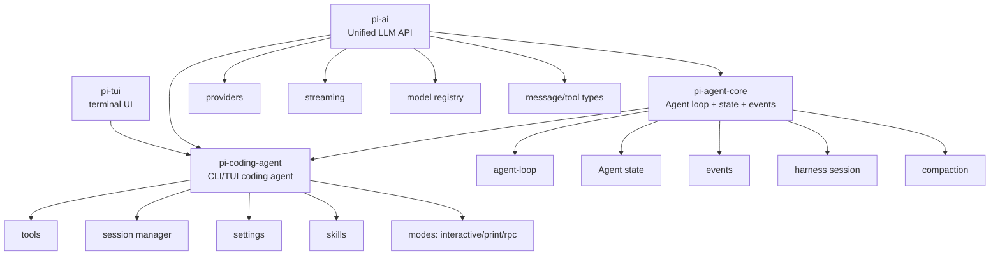
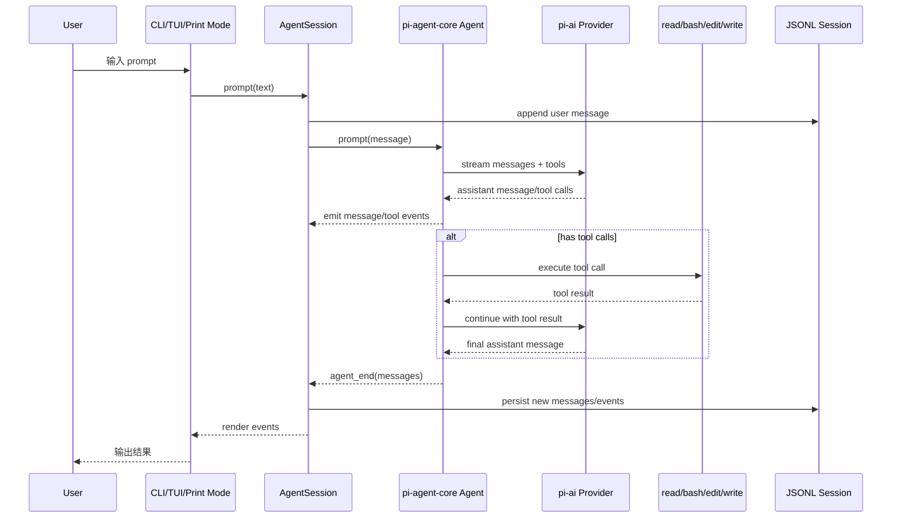
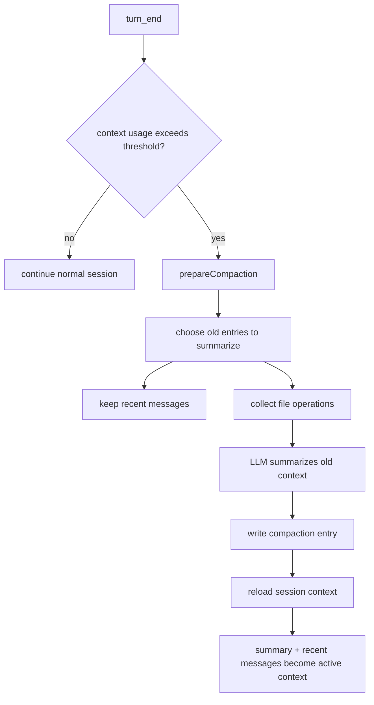

# pi-mono 核心架构分析与 pi-claw 完成计划

本文基于 Mario Zechner 的文章《What I learned building an opinionated and minimal coding agent》以及本地 `earendil-works/pi` 项目结构整理，只关注三个核心包：`pi-ai`、`pi-agent-core`、`pi-coding-agent`。

## 1. 总体判断

pi-mono 的核心不是“大而全的框架”，而是三层清晰分工：

1. `pi-ai`：屏蔽模型供应商差异，提供统一 LLM streaming/tool-call API。
2. `pi-agent-core`：实现 agent loop、状态、事件、工具执行、队列和中断。
3. `pi-coding-agent`：把通用 agent runtime 组合成可用的 coding agent CLI/TUI，包括工具、会话、配置、压缩、skills、slash commands。

其设计重点是：少量通用工具、完整可观察事件流、显式上下文控制、JSONL 会话持久化、长会话 compaction，以及 Unix 风格组合能力。

## 2. Package 职责

### 2.1 `packages/ai` / `@earendil-works/pi-ai`

职责：统一 LLM API。

关键内容：

- `src/types.ts`：统一的 `Message`、`AssistantMessage`、`Tool`、`Usage` 等类型。
- `src/stream.ts`：统一 streaming 抽象。
- `src/api-registry.ts`：provider/model 注册。
- `src/models.ts`、`src/models.generated.ts`：模型注册表。
- `src/providers/*`：Anthropic、OpenAI Completions、OpenAI Responses、Google、Mistral、Bedrock 等 provider 适配。
- `src/env-api-keys.ts`：环境变量 API key 解析。
- `src/utils/*`：JSON partial parsing、overflow 检测、validation、proxy、headers 等。

对 `pi-claw` 的启发：当前不需要多 provider 抽象，但应保持一个很薄的 LLM 边界：`messages + tools + model config -> assistant message`，不要让 runtime 直接耦合某个 SDK 细节。

### 2.2 `packages/agent` / `@earendil-works/pi-agent-core`

职责：通用 agent runtime。

关键内容：

- `src/agent-loop.ts`：核心循环。
- `src/agent.ts`：有状态 `Agent` 包装，管理 messages、tools、pending tool calls、steering/follow-up queue、abort、事件订阅。
- `src/types.ts`：Agent 事件、工具、状态、上下文等核心类型。
- `src/harness/session/*`：JSONL/memory session repo。
- `src/harness/compaction/*`：会话压缩。
- `src/harness/system-prompt.ts`：系统提示词加载。
- `src/harness/skills.ts`：skill 发现/加载。

核心 loop 逻辑：

1. 接收用户 message。
2. 写入当前 context。
3. 调 LLM stream assistant response。
4. 如果 assistant message 有 tool calls，则执行工具。
5. tool result 写回 context。
6. 继续调用 LLM，直到没有 tool calls 或终止。
7. 过程中持续 emit 事件。

### 2.3 `packages/coding-agent` / `@earendil-works/pi-coding-agent`

职责：将 core agent 变成实际 CLI coding agent。

关键内容：

- `src/cli.ts`、`src/main.ts`：命令入口。
- `src/core/agent-session.ts`：上层 AgentSession，统一 interactive/print/rpc 三种运行模式。
- `src/core/agent-session-runtime.ts`：运行时绑定。
- `src/core/session-manager.ts`：会话文件、树结构、branch、metadata。
- `src/core/compaction/*`：coding agent 级别 compaction，带文件读写追踪。
- `src/core/tools/*`：`read`、`bash`、`edit`、`write`、`grep`、`find`、`ls`。
- `src/core/skills.ts`：skills 加载。
- `src/core/system-prompt.ts`：AGENTS.md、项目上下文、工具说明组合。
- `src/modes/interactive/*`：TUI/交互模式。
- `src/modes/print-mode.ts`：一次性 print/headless 模式。
- `src/modes/rpc/*`：RPC 模式。

它不是把所有能力塞进 core，而是在 coding-agent 层组合：配置、工具集、会话、压缩、UI、扩展和模式。

## 3. Mermaid：包依赖关系

## 4. Mermaid：Agent Runtime 流程

## 5. Mermaid：长会话 Compaction 流程

## 6. pi-mono 对 pi-claw 的落地取舍

`pi-claw` 当前已有：

- Python 版 `AgentRuntime` / `AgentSession`
- JSONL session store
- 事件流
- 基础工具
- Skill loader
- CLI/TUI 入口
- settings 加载

因此最后阶段不应该照抄 pi-mono 的多 provider、RPC、复杂 TUI、扩展系统，而应补齐最影响可用性的核心闭环。

## 7. 最后几个完成内容计划

### Milestone 1：Session Compaction

目标：长对话可持续运行。

内容：

- 在 settings 中增加 `compact_enabled`、`compact_keep_recent_turns`、`compact_max_messages` 或简化 token 阈值。
- 在 `AgentSession` 或 `AgentRuntime` turn 结束后判断是否需要压缩。
- 把旧消息总结成一条 `compaction_summary` message。
- JSONL 记录 compaction 事件。
- 恢复会话时能加载 summary + recent messages。

这是下一步最高优先级。

### Milestone 2：Session Tree / Resume / Branch 简化版

目标：接近 pi 的 continue/resume/branch 体验。

内容：

- `--resume` 稳定加载当前 session。
- `--session NAME` 支持多个 session 文件。
- 增加 `--list-sessions`。
- 增加 `--branch FROM --session NEW_NAME` 简化分支能力。

不需要完整 tree UI，先用文件级 session 管理即可。

### Milestone 3：工具层打磨

目标：让 coding agent 的四个核心工具稳定。

内容：

- 明确核心可写工具：`read`、`write`、`edit`、`bash`。
- 保留只读辅助工具：`grep`、`find`、`ls`。
- `edit` 保持 exact replacement。
- `bash` 记录 command、exit code、stdout/stderr preview。
- 文件修改工具输出结构化 details，供 compaction 跟踪读写文件。

### Milestone 4：System Prompt / AGENTS.md / Context Loader

目标：显式上下文工程。

内容：

- 加载项目根目录 `AGENTS.md`。
- 加载 `.openclaw/system_prompt.md` 和 `.openclaw/context.md`。
- 在启动时输出当前加载了哪些上下文文件。
- 保持 system prompt 短，不要塞大段教程。

### Milestone 5：Print Mode / Headless Mode

目标：能被脚本、tmux、其他 agent 调用。

内容：

- 增加 `--print "prompt"` 或 `-p "prompt"`。
- 只输出最终 assistant 文本。
- 可选 `--json` 输出事件 JSONL。
- 这比复杂 TUI 更接近 pi 的 Unix 组合哲学。

### Milestone 6：TUI 最小稳定化

目标：让事件流可视化，而不是做完整 UI 框架。

内容：

- 显示 user/assistant/tool/error/compaction 事件。
- 显示当前 session/model。
- 支持 resume。
- 暂不实现复杂 keybinding、主题、差分渲染。

## 8. 不建议近期实现

- 多 provider 大一统：当前 OpenAI-compatible 足够。
- MCP：上下文开销大，违背当前极简目标。
- 完整扩展系统：先用 Skill。
- 多 agent/subagent：可以先通过 shell/tmux/print mode 组合。
- 完整 TUI 框架：等 runtime 稳定后再做。

## 9. 推荐立即执行顺序

1. 实现 Session Compaction。
2. 给工具结果补充 structured details，追踪 read/modified files。
3. 完善 resume/list/branch session 管理。
4. 增加 print/headless mode。
5. 最后整理 TUI 展示。

如果只剩一个核心功能要做，优先做 compaction。它是从“能聊天的 demo”变成“能持续工作的 agent”的分界线。
